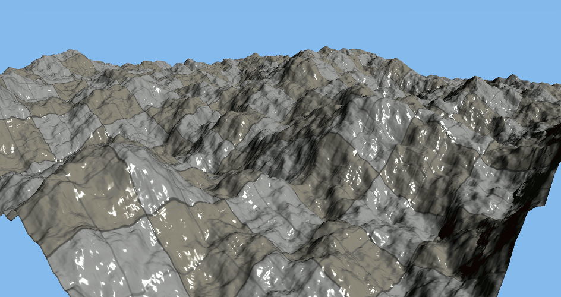

# CrowdEngine

A real-time 3D rendering engine that I developed as a high-school student, at a
time when I was especially fond of computer graphics. 3D graphics is actually
the reason why I discovered computer programming in the first place, because
while using tools like [Blender](https://www.blender.org/) I got
curious about how such programs worked, and decided to learn.

I tried to design things a bit seriously, so I split the project between the
[engine library](CrowdEngine) and a [running application](RunApp), which loads
the engine library. The engine uses C++ and
[Direct3D10](https://en.wikipedia.org/wiki/Direct3D#Direct3D_10) to implement
an extensible pipeline based on [deferred rendering](https://en.wikipedia.org/wiki/Deferred_shading).

Of course, implementing a full real-time engine is a tremendous
task, and things got even more complicated because I reimplemented a lot of
basic utilities, following my desire to understand as many things as possible, 
Despite this, 10k lines of code down the road I had managed to get a
handful of functionalities, including an elementary pipeline and foundations for
my shader library, basic resource management, scene management,
a mathematics library, a [plugin for
Maya](https://github.com/Kachoc/MayaExporter),
a noise generator, or basic terrain generation.
However, I had to put the
project aside the moment it started to become really interesting, because I then
began studying for my bachelor and didn't have time for side projects anymore.

Still, working on this engine proved very fun and I learnt (really) a lot while
doing so, both by implementing the engine and by reading computer graphics
tutorials and blogs. The passion I grew for computer science at that time
definitely influenced me when I later had to choose my area of specialization while a
student at *École polytechnique*.

