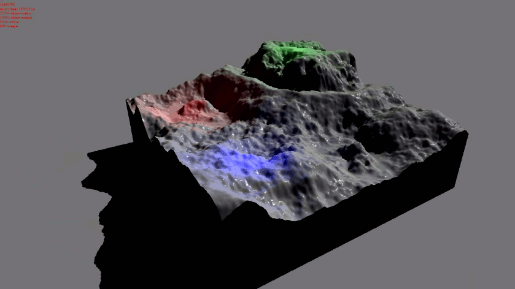

# CrowdEngine
A real-time 3D rendering engine that I developed as a high-school student, at a
time when I was especially fond of computer graphics. 3D graphics is actually
the reason why I discovered computer programming in the first place, because
while using tools like [Blender](https://www.blender.org/) I got curious about
how such programs worked, and decided to learn.

I tried to design things a bit seriously, so I split the project between the
[engine library](CrowdEngine) and a [running application](RunApp), which loads
the engine library. The engine uses
[Direct3D10](https://en.wikipedia.org/wiki/Direct3D#Direct3D_10) and C++ to implement
an extensible pipeline based on [deferred rendering](https://en.wikipedia.org/wiki/Deferred_shading).

Of course, implementing a full real-time engine is a tremendous
task, and after a lot of work and 10k LOC I had managed to get a
handful of useful features, including an elementary pipeline and foundations for my shader library,
basic ressource management, scene managers,
a mathematics library, a plugin for Maya, a noise generator, basic terrain
generation, and a lot of of utilities
(logger, smart pointers, multithreading, etc.). However, I had to put the
project aside the moment it started to become really interesting, because I then
started studying for my bachelor and didn't have time for side projects.

Still, working on this engine proved very fun and I learnt (really) a lot while
doing so, both by implementing the engine and by reading computer graphics papers,
tutorials and blogs. The passion I grew for computer science at that time
definitely influenced me later on when I had to choose my area of specialization while a
student at *École polytechnique*.

